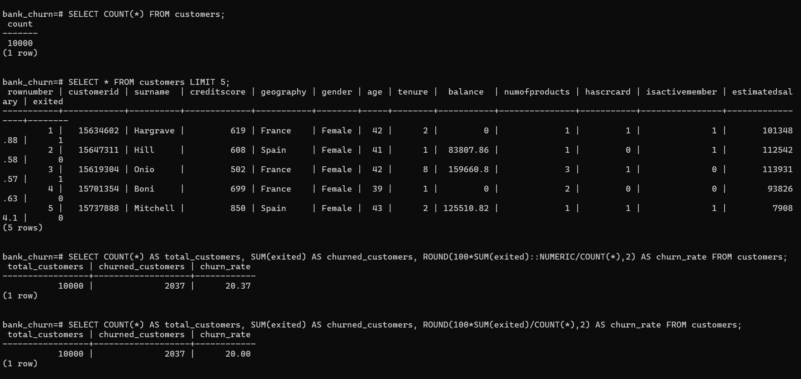
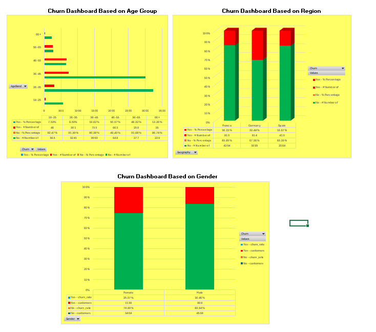
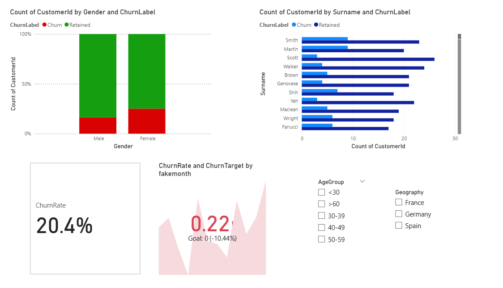
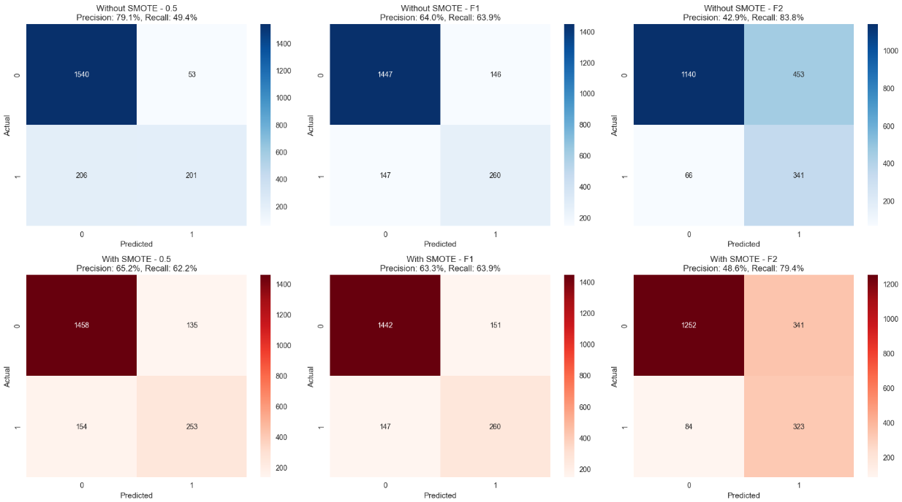

# 📊 Customer Churn Analysis & Prediction

## 📌 Project Overview
This project explores customer churn using a dataset of 10,000 entries sourced from Kaggle.  
It combines data analysis (SQL, Excel, Power BI) with a machine learning pipeline (Python, scikit-learn, XGBoost, LightGBM, Gradient Boosting) to predict churn and demonstrate real-world applicability.

After developing and benchmarking multiple models, the final Gradient Boosting classifier was selected for deployment.  
To showcase practical use, a custom software solution was created that connects to the customer database and updates records in real time.  
This application flags churn‑risk customers as data is updated, allowing to visualize real life usage of this model.  
The workflow therefore spans the full lifecycle: **exploration → visualization → modeling → deployment → real-time prediction**.

---

## 🛠️ Workflow

### 1. Data Analysis
- **SQL**: Initial exploration of dataset structure and churn distribution.  
- **Excel**: Pivot tables and charts for early visualization.  
- **Power BI**: Advanced dashboards and interactive visualizations.
  
## 🗄️ SQL Exploration
Initial data exploration and queries were performed using SQL.  


---

## 📊 Excel Analysis
Pivot tables and charts were created in Excel to summarize churn patterns.  


---

## 📈 Power BI Dashboard
Interactive dashboards were built in Power BI to visualize customer churn trends.  



### 2. Machine Learning Pipeline (Python)
#### Environment Setup
- Libraries: `pandas`, `numpy`, `matplotlib`, `seaborn`, `scikit-learn`, `xgboost`, `lightgbm`, `imbalanced-learn`, `joblib`

#### Data Preparation & Exploration
- Dataset: `churn.csv` (10,000 rows × 14 columns)  
- Churn rate: **20.37%** (2,037 customers)  
- Verified no missing values  
- Statistical summaries & visualizations  

#### Preprocessing
- Dropped irrelevant columns (`RowNumber`, `CustomerId`, `Surname`)  
- One-hot encoding for categorical variables (`Geography`, `Gender`)  
- Train-test split (80/20, stratified)  
- StandardScaler applied to numerical features  

#### Handling Class Imbalance
- Applied **SMOTE** to balance churn vs non-churn classes  
- Tested impact on model performance  

---

### 3. Model Training & Evaluation
- Algorithms: Logistic Regression, Random Forest, XGBoost, LightGBM, Gradient Boosting  
- Metrics: Accuracy, Precision, Recall, F1-score, ROC-AUC  
- Visuals: Confusion matrices, ROC curves  
- **Best Model**: Gradient Boosting with **F1-optimized threshold**  
- Precision & Recall: ~65% each  
- Feature importance analysis for tree-based models

Machine learning models were trained and evaluated in Python.  
Confusion matrix of the best model:  


---

### 4. Deployment Simulation
- **Database Integration**:  
  - Script to create and update a lifelike customer database  
  - Prediction script to flag churn-risk customers in real time  
  - Utility function for single-customer churn prediction  

---

## 📈 Key Results
- Gradient Boosting chosen as final model  
- Precision & Recall around **65%**  
- Demonstrated end-to-end workflow: from raw data → insights → predictive model → deployment simulation  

---

## 📂 Repository Structure
```
CHURN ANALYSIS/
├── bank_churn.sql          # SQL queries for initial exploration
├── bank_sim.db             # SQLite database for simulation
├── bank.py                 # Script to create/update database
├── main.ipynb              # Notebook with analysis, preprocessing, model training
├── predictor.py            # Script to flag churn-risk customers / single prediction
├── churn analysis.xlsx     # Excel pivot tables & charts
├── churn_risk_model.pkl    # Saved best model (Gradient Boosting)
├── churn.csv               # Dataset (10,000 rows × 14 columns)
├── churn.pbix              # Power BI dashboard
└── README.md               # Project documentation
```

---

## 🚀 How to Run
1. Clone the repo  
2. Open `main.ipynb` and run cells (includes environment setup and pip installs)  
3. Run analysis notebooks for exploration and model training  
4. Use `bank.py` to simulate customer data and update database  
5. Run `predictor.py` to flag churn-risk customers or predict for a single customer  

---
